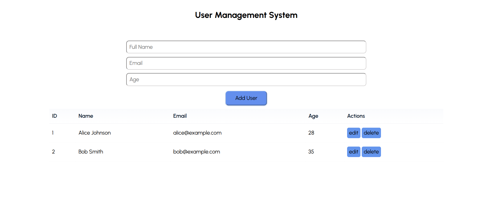
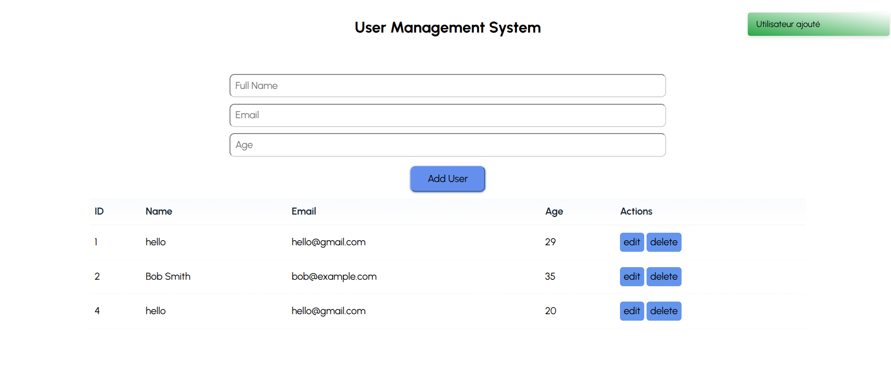
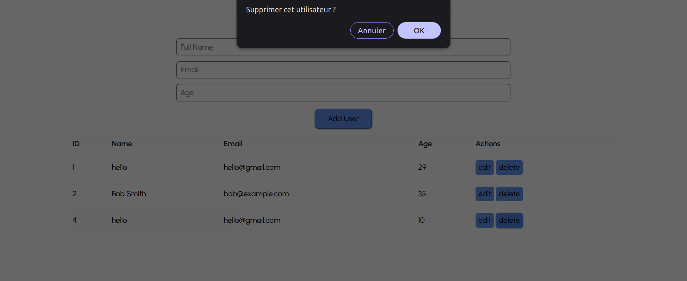
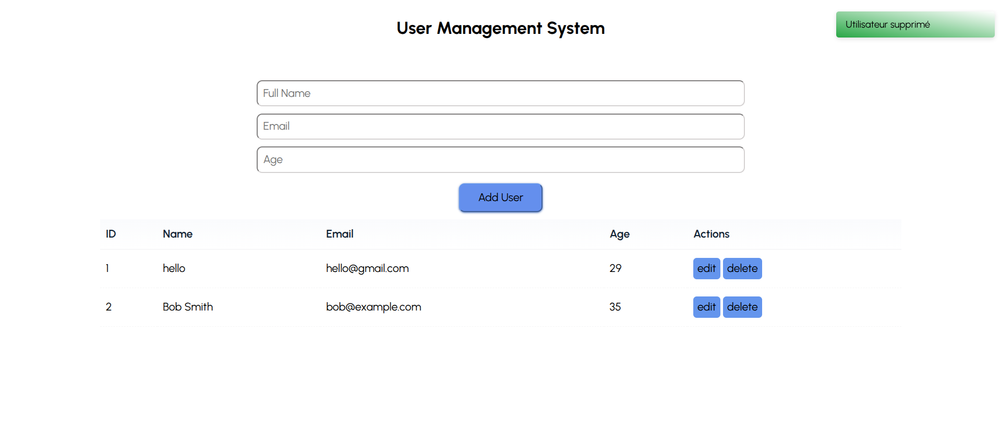

# User Management Pro

A lightweight, modern web application for managing user data with persistent local storage.

## Features

- ✅ **Add Users** - Create new users with name, email, and age
- ✅ **Edit Users** - Update existing user information
- ✅ **Delete Users** - Remove users from the system
- ✅ **View All Users** - Display all users in an interactive table
- ✅ **Local Storage** - All data persists automatically in browser storage
- ✅ **Initial Data Loading** - Load users from `data.json` on first run
- ✅ **Form Validation** - Real-time validation for all user fields
- ✅ **Toast Notifications** - Success, error, and info messages
- ✅ **Responsive Design** - Works on desktop and mobile devices

## Screenshots

### Main Interface

*Clean and intuitive user interface with form and user table*

### Add User

*Simple form to add new users with validation*

### Edit User

*Pre-filled form for editing existing user information*

### delete User confirmation

*Pre-filled form for deleting existing user information*

### delete User

*Pre-filled form for deleting existing user information*

## Project Structure

```
userManagement_pro/
├── src/
│   ├── models/
│   │   ├── User.js          # User class with validation
│   │   └── UserManager.js   # User management logic
│   ├── services/
│   │   ├── api.js           # API calls (data.json loading)
│   │   └── storage.js       # LocalStorage service
│   ├── ui/
│   │   ├── UIManager.js     # UI event handling and rendering
│   │   └── Toast.js         # Toast notification system
│   ├── utils/
│   │   └── errors.js        # Custom error classes
│   └── main.js              # Application entry point
├── style.css                # Styling
├── index.html               # Main HTML file
└── data.json                # Initial user data
```

## Installation & Usage

1. Clone or download the project
2. Open `index.html` in your browser
3. Start managing users!

## Validation Rules

- **Name**: Required, minimum 2 characters
- **Email**: Must contain `@` and `.`
- **Age**: Must be an integer between 1 and 120

## Technical Stack

- **Vanilla JavaScript** (ES6 Modules)
- **LocalStorage API** for persistence
- **CSS3** for responsive styling
- **Custom Error Handling** for better UX

## How It Works

1. **On Load**: Checks localStorage for existing users. If empty, loads initial data from `data.json`
2. **Add/Edit/Delete**: Updates are saved to localStorage automatically
3. **Form Validation**: Validates input before submission and shows errors via Toast
4. **Counter System**: Auto-increments user IDs, preserves them on page reload

## Browser Compatibility

Works in all modern browsers supporting:
- ES6 Modules
- LocalStorage API
- CSS Flexbox

---

**Built with ❤️ in Vanilla JavaScript**